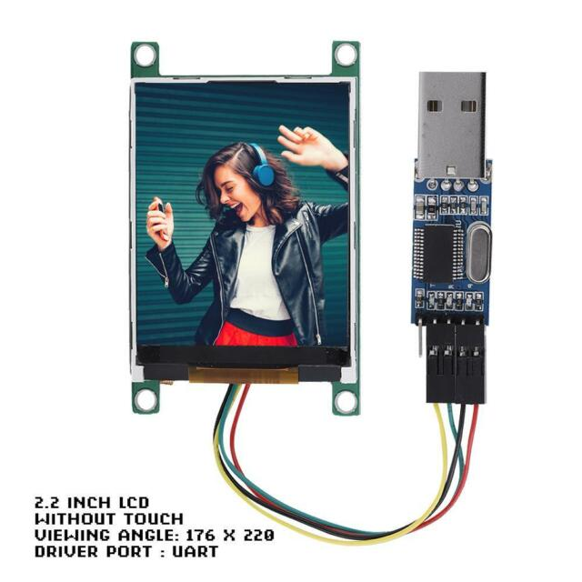
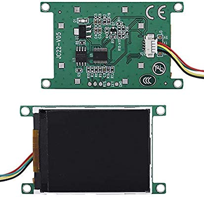
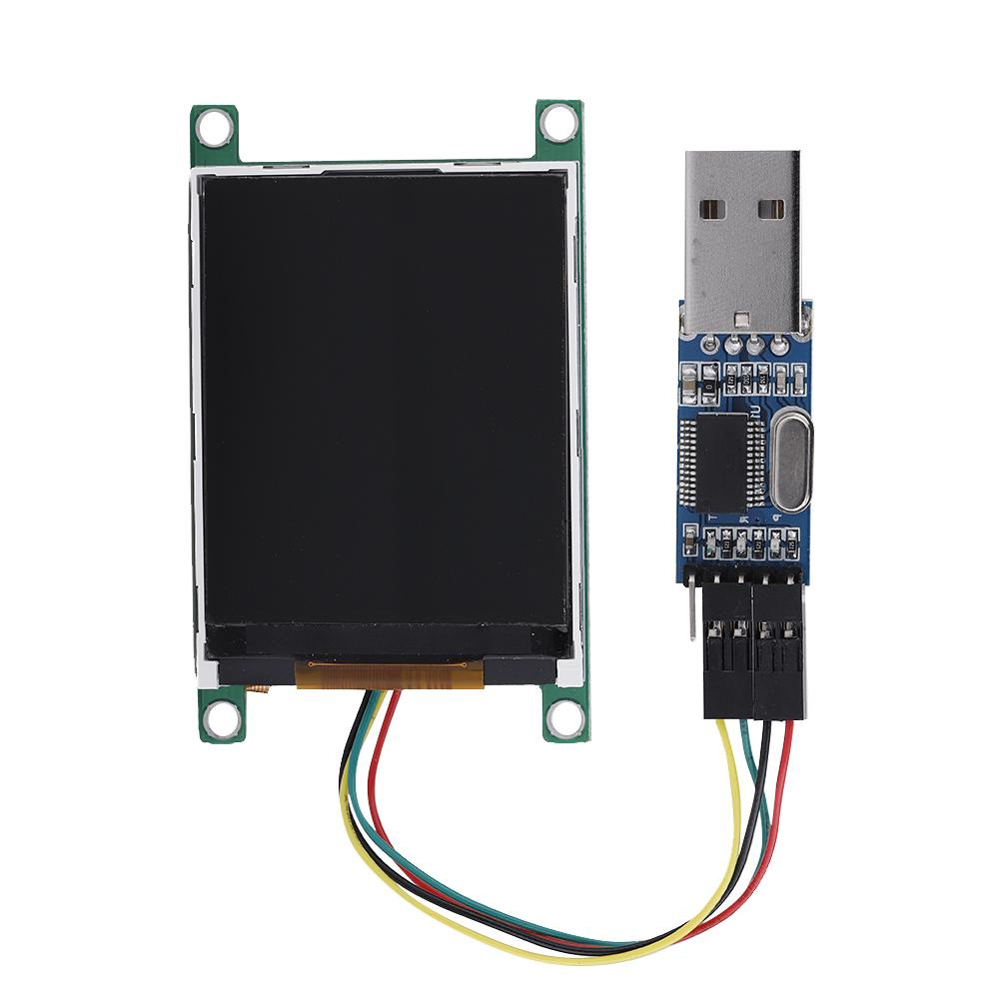

# serial-lcd-uart-jc22-v05

Librería para interactuar con la pantalla tft de 2,2 pulgadas JC22-v05 que trabaja únicamente comunicándose por Serial

## Descripción

Al encontrarme con poca información o errónea me dedico a preparar esta librería con los usos que le voy dando a esta pantalla.

## Colores

|     Color   |      Nº      |
|  :-------:  |  :--------:  |
|  0          |  black       |
|  1          |  red         |
|  2          |  green       |
|  3     |  blue          |
|  4     |  yellow          |
|  5     |  cyan-blue          |
|  6     |  purple          |
|  7     |  gray          |
|  8     |  Light gray          |
|  9     |  brown          |
|  10     |  Dark green          |
|  11     |  Navy blue          |
|  12     |  Dark yellow          |
|  13     |  Orange          |
|  14     |  Light red          |
|  15     |  white          |

## Comandos

